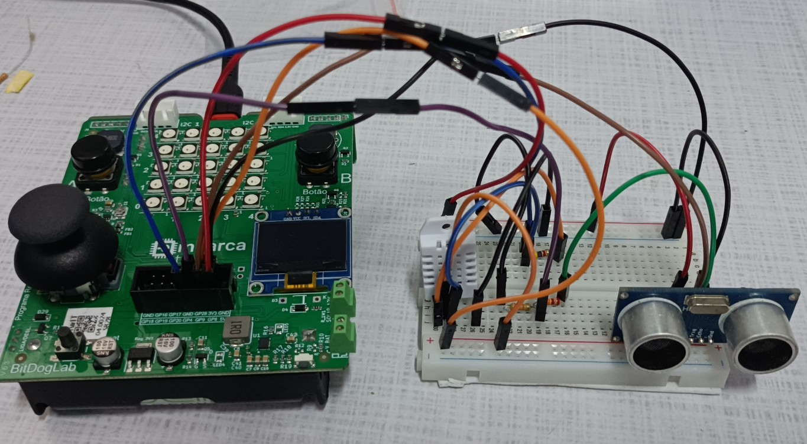

[

](https://hardware.org.br/embarcatech-inscricao/)
# :man: Vagner Sanches Vasconcelos

Residência Tecnológica em Sistemas Embarcados (EmbarcaTech 2025)     
[Instituto Hardware Brasil - HBr](https://hardware.org.br/)     
Campinas, março de 2025     
---
## :books: Sobre este repositório

Este repositório reúne os projetos desenvolvidos ao longo da capacitação em Sistemas Embarcados, bem como na etapa de residência tecnológica.   
Cada projeto tem sua própria pasta, contendo:    
- Código-fonte (\src);   
- Documentação (\docs);   
- Outros recursos, tais como : imagens, videos, entre outros (\assets).    
---

[

](https://youtu.be/aS0tE-y4iuQ?si=hzk-_8a9BiZnrDN6)

## 📂 Lista de Projetos

| Projeto | Descrição |
|---------|-----------|
| [Monitoramento de tunel frio](./projetos/tunel_frio/) | Monitoramento de túneis frio em data centers |

---
##   :dart: Diário de Bordo (Reflexões e Aprendizados)    
Ao longo desta jornada, esta seção será atualizada com os principais aprendizados, desafios enfrentados e soluções encontradas.   

### Semana 1

- Entendi como funciona a comunicação I2C com displays OLED.
