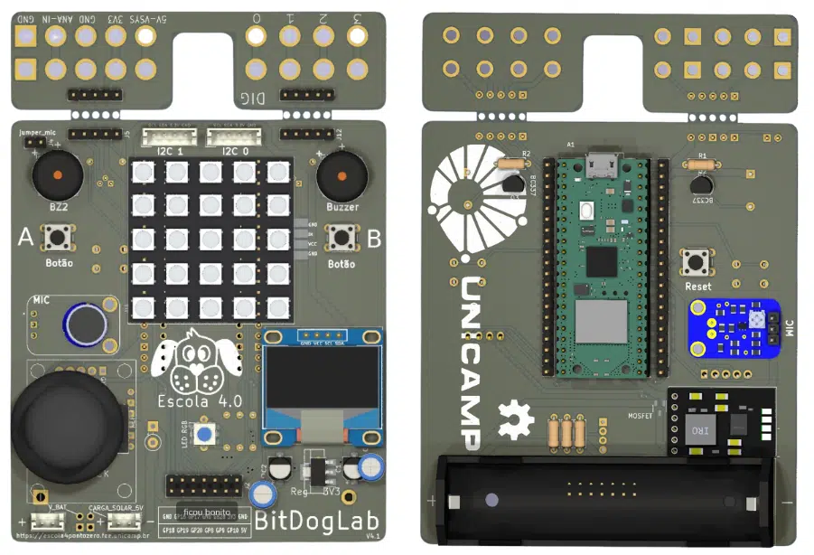

[

](https://hardware.org.br/embarcatech-inscricao/)
# :man: [Vagner Sanches Vasconcelos](https://www.datascienceportfol.io/vsvasconcelos)

Residência Tecnológica em Sistemas Embarcados (EmbarcaTech 2025)     
[Instituto Hardware Brasil - HBr](https://hardware.org.br/)     
Campinas, março de 2025     
---
## :books: Sobre este repositório

Este repositório reúne os projetos desenvolvidos ao longo da capacitação em Sistemas Embarcados, bem como na etapa de residência tecnológica.   
Cada projeto tem sua própria pasta, contendo:    
- Código-fonte (\src);   
- Documentação (\docs);   
- Outros recursos, tais como : imagens, videos, entre outros (\assets).    
---

[

](https://youtu.be/aS0tE-y4iuQ?si=hzk-_8a9BiZnrDN6)

## 📂 Lista de Projetos

| Projeto | Descrição |
|---------|-----------|
| [Monitoramento de tunel frio](./projetos/tunel_frio/) | Monitoramento de túneis frio em data centers |
| [Contador Regressivo](./projetos/contador/)| Controle do display OLED, comunicação I2C e interrupções|
| [Joystick](./projetos/joystick/)| Controle do joystick e display OLED|
| [Temperatura](./projetos/temperatura/)| Medição da temperatura interna do RP2040|
| [galton board](./projetos/galton_board/)| Tabuleiro de Galton na BitDogLab|

---
##   :dart: Diário de Bordo (Reflexões e Aprendizados)    
Ao longo desta jornada, esta seção será atualizada com os principais aprendizados, desafios enfrentados e soluções encontradas.   

### Semana 1 (17/03/25)
- Apresentação do programa de residência tecnológica.   

### Semana 2 (24/03/25)
- Apresentação dos projetos desenvolvidos na capacitação em sistemas embarcados.   

### Semana 3 (31/03/25)
- Visão geral do microncontroladores, microprocessadores, FPGA, ASIC e SBC.    
- Visão geral do github

### Semana 4 (07/03/25)
- Visita a sede do [Instituto Hardware Brasil - Hbr](https://www.hardware.org.br/) no Parque científico e tecnológico da [Unicamp](https://parque.inova.unicamp.br/) e alguns laboratórios da [FEEC Unicamp](https://www.fee.unicamp.br/).  
